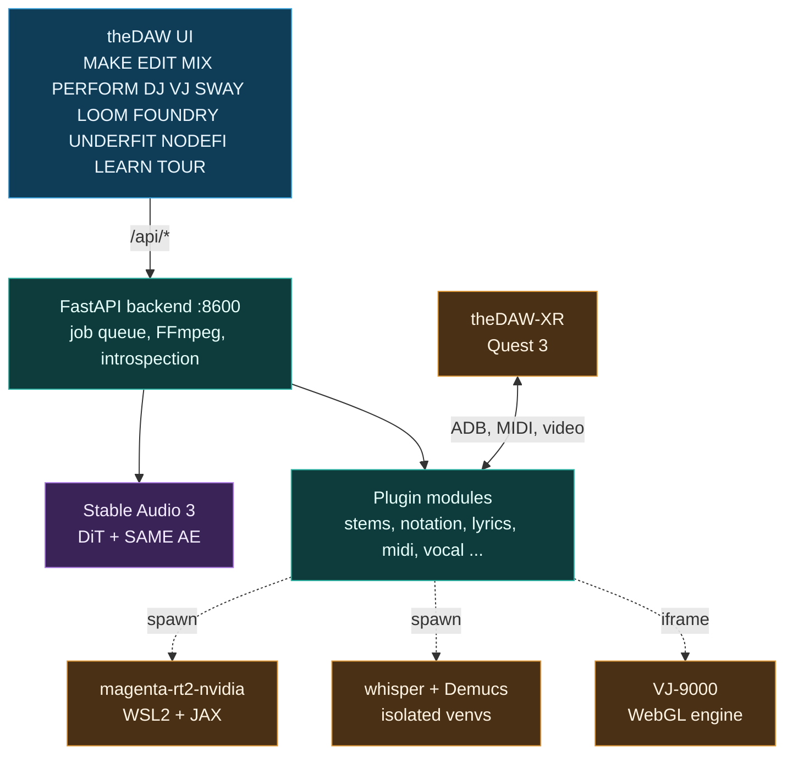

<h1 align="center">theDAW (Pinokio launcher)</h1>

<p align="center"><strong>by <a href="https://gantasmo.com">GANTASMO</a></strong></p>

<p align="center">
  <a href="https://github.com/gantasmo/theDAW"></a>
  
  
  
</p>

<p align="center">
  <a href="https://open.spotify.com/artist/4q5n0QgK6mvyuw8FRzhuNA"></a>
  <a href="https://www.youtube.com/@GANTASMO"></a>
  <a href="https://www.instagram.com/gantasmo"></a>
  <a href="https://x.com/gantasmo"></a>
  <a href="https://gantasmo.com"></a>
</p>

---

This is the one-click Pinokio launcher for **[theDAW](https://github.com/gantasmo/theDAW)**, a free music studio that runs on your own computer. You can generate a track from a text prompt, edit and mix it, turn it into sheet music, sing along to it with timed lyrics, DJ it, play it live, and run visuals behind it. Everything stays on your machine. There is no account and no subscription. The generator is Stable Audio 3, trained on licensed, ethically sourced audio, and UNDERFIT turns your own recordings into your own LoRA on your own GPU, so even the training step never touches a datacenter.

Install and Start below handle the whole stack: Python, CUDA, FFmpeg, the frontend, the LoRA trainer, the visual engine and the default model.

<p align="center">
  
</p>

## What the launcher does

- **Install** clones the repo into `app/`, pulls the Magenta sidecar submodule, installs FFmpeg through conda, resolves all Python dependencies with `uv sync --group dev`, builds the optional Underfit trainer environment, installs the frontend and VST Foundry packages with `npm install`, clones the VJ-9000 app, clones and builds the SwayCommand cockpit for the SWAY tab, and pre-fetches the default generation model from the public mirror (Medium on Windows and Linux, Small on macOS) so the first CREATE does not wait on a download.
- **Start** launches the FastAPI backend through its restart supervisor on `http://localhost:8600`, then the Vite frontend on `http://localhost:5173`, and opens the app once the URL appears. Settings → Restart Server works under the launcher: the backend comes back inside the same Pinokio terminal.
- **Update** pulls the launcher and the app repos, refreshes the submodule, re-syncs the Python, Underfit and npm dependencies, re-provisions the VJ app if it is missing, and rebuilds the SwayCommand cockpit.
- **Reset** deletes the dependency trees only: `app/.venv`, `app/underfit/.venv`, and the `node_modules` folders of the frontend, VST Foundry and VJ app. Your library, settings and generated audio under `app/data` stay put. The next Install rebuilds the dependencies from clean.

The other Stable Audio 3 checkpoints are one click away under **Download Models** (Small ARC, Small RF, Medium ARC, Medium RF), and theDAW also downloads any model the first time a generation needs it. The launcher points `HF_HOME` at the standard user Hugging Face cache (`~/.cache/huggingface`) rather than an isolated per-app cache, so checkpoints and the Hugging Face auth token already on the machine are reused. The official Stable Audio 3 and t5gemma repos are gated; the app falls back to a public mirror of the same weights automatically, and a Hugging Face token (the in-app sign-in, or `hf auth login`) unlocks the official repos.

## First run

1. Click **Install** and wait for the dependency sync to finish.
2. Click **Start**. The backend comes up first, then the web UI; the **Open App** tab appears when the URL is ready.
3. Open the MAKE tab, type a prompt, press CREATE. Models do not download by themselves — allow downloads once in **Settings → Models** and the first CREATE fetches what it needs. The `small` model runs on a CPU; `medium` needs an NVIDIA GPU.
4. Right-click the new track in the library to open it in EDIT, MIX, SCORE or SING, or to load it on a DJ deck. The assistant orb in the bottom left answers questions about the app from the manual, and the in-app **TOUR** walks through every tab.

## What you can do

| Tab | What it is for |
|---|---|
| **MAKE** | Generate audio from a text prompt, from your own audio, or by filling in a painted region. Chimera combines several clips into one track. Suno (cloud) and Magenta RealTime 2 are in the same model list. |
| **EDIT** | A multitrack timeline. Cut, move and fade clips, record automation, add insert effects per track, and render the arrangement to a WAV file. |
| **MIX** | Mastering and effects. A chain of 25 effects, each with its own control panel, Quick Master knobs, VST3 plugins, `.gan` web-plugins and LUFS metering. |
| **SCORE** | Audio to MIDI to notation. Sheet music, tablature, arrangements, drum notation, and four play-along views that follow the track. Exports a Beat Saber level. |
| **SING** | Lyrics that follow the song word by word. Paste lyrics and a forced aligner times every word against the vocal, or tap the timing yourself. Imports and exports LRC. Scores your pitch. Puts the score, or a reading of the lyric's rhyme scheme and literary devices, beside the words. |
| **LYRIC** | A notebook for lyrics that belong to no song yet. Write with syllable counts and rhyme classes in the gutter, the analysis reading along beside you, and save a draft into a song when it is ready. |
| **DJ** | Two decks with beat sync, key lock, hotcues, loops, live stems, an FX rack, a sampler, and Automix that plays prepared performance sets and takes instructions from the assistant mid-show. |
| **VJ** | The [VJ-9000](https://github.com/gantasmo/VJ-9000) visual engine: audio-reactive terrain, cameras, GLSL shaders, cymatics, a GPU effect chain, and recording. |
| **LOOM** | A living colony of loops cut from your own library. Cells divide, envelop and wither on the beat clock while it plays. |
| **SWAY** | The SwayCommand gesture cockpit: scenes, a timeline and gesture axes bound to macros, driven by a camera or the Audima Sway. |
| **PERFORM** | Launch scenes and clips from a grid. Opens Ableton sets and `.tasmo` projects. Pad effects and controller routing. |
| **FOUNDRY** | Design a plugin interface on a canvas and export it as a `.gan` web-plugin. |
| **NODEFI** | Connect generation, effects and library nodes into a graph. Run it as a pipeline or play it live. |
| **UNDERFIT** | Train LoRA adapters on your own audio and use them when generating. |
| **LEARN** | A graph of your library: every remix, stem split, blend and cover, drawn in 3D or 2D. |
| **TOUR** | Plan live dates on a map: venues, promoters, festivals, booking contacts and a route. |

**Included at no cost.** Stem separation up to 12 stems, a mastering suite, VST3 hosting, the HRTF spatializer The Owl, DJ decks with sync and Automix, audio-to-MIDI with engraving, LoRA training, forced-aligned lyrics with a whisper review, a rhyme and literary reading of any lyric, and export to WAV, MP3, FLAC, OGG, AIFF, Opus, M4A, MIDI, MusicXML and LRC. Every model in that list runs on the GPU when there is one, one at a time, and never twice for the same song.

**Only in theDAW.** [theDAW-XR](https://github.com/gantasmo/theDAW-XR) hand-tracked control on Meta Quest 3, Chimera clip fusion, DRAW (draw on a canvas to play generative music), native Audima Sway motion-controller support, The Foundry plugin designer, import of Ableton, Reaper, FL Studio, Audacity, Audition, Bitwig and Resolume projects, the first non-Mac port of Magenta RealTime 2, and 28 themes plus a custom theme built from any image.

---

## How to do each thing

### Generate a track: MAKE

<p align="center"></p>

Type a prompt in the PROMPT box and press CREATE. The CONTROLS panel sets the model, the length in seconds, the number of sampler steps, the CFG scale, the seed and the batch size. To generate from your own audio, drop a file on the INIT slot and set the noise level: a low value stays close to the source, a high value moves away from it. To regenerate only part of a track, drop it on the INPAINT slot and paint the region to replace. Templates save a full set of controls, and the SAVED list keeps your prompts. Every result is saved to the library.

**Chimera** combines several clips into one track. Drop two or more clips on the CHIMERA STACK. Chimera analyzes the tempo and key of each clip, cuts them on the beat grid, pitches them into one key, arranges the pieces into a song, and asks the model to regenerate the joins so they do not click.

**Suno** generates in the cloud. Pick it in the model list for simple, custom, cover and mashup modes. **Magenta RealTime 2** runs through [magenta-rt2-nvidia](https://github.com/gantasmo/magenta-rt2-nvidia), theDAW's own port for Windows with WSL2, native Linux, or a cloud GPU. Steer it with a style clip, MIDI notes on the keyboard, or both.

### Arrange and edit: EDIT

<p align="center"></p>

Drag clips along a track or onto another track with the Move tool. Split a clip with the Cut tool. Drag a clip's corner handles to set fade in and fade out. Each track has mute, solo, volume, pan and its own insert effects. Turn on WRITE and move a control during playback to record automation. COMMIT EDIT renders every audible track into one 44.1 kHz stereo WAV.

### Master and add effects: MIX

<p align="center"></p>

Add effects from the EFFECTS list to the CHAIN. Audio flows through the chain from left to right. The 25 effects cover mastering, compression, filters, vocal processing, lo-fi, stereo widening, reverb, delay, LUFS normalization and pitch shift, and each one opens its own control panel. The four QUICK MASTER knobs (PUNCH, AIR, DRIVE, CEIL) set the most common mastering moves in one place. VST3 plugins found in the standard plugin folders appear in the same list, and `.gan` web-plugins open in the effect stage. Press PROCESS CHAIN to render.

<p align="center">
  
</p>

<sub align="center">The Owl is a <code>.gan</code> web-plugin included with theDAW, alongside the Ares multi-effect shown under FOUNDRY below. Any FOUNDRY design exports to the same format.</sub>

### Turn audio into sheet music: SCORE

<p align="center"></p>

Right-click a track in the library and choose **Convert to MIDI** (a drum stem gets a drum-kit transcription). Then open the SCORE tab in the bottom panel with that track selected. **MAKE SHEET** engraves the MIDI as MusicXML sheet music, **MAKE TABS** writes guitar, bass or ukulele tablature for a chosen tuning, capo and difficulty, **ARRANGE** builds a lead sheet, a piano reduction, a simplified part or a band score with drums on a percussion staff, and **MAKE CHORDS** derives a chord track from the lead sheet or estimates one from the audio. Scores export to PDF, SVG, ABC and MusicXML.

<p align="center">
  
  
</p>

Every score is also a **play-along**. **PAGE** moves a cursor over the engraved pages, **STRIP** scrolls one continuous staff under a now-line, **CHORDS** shows guitar, bass or ukulele chord diagrams, and **HIGHWAY** shows the notes travelling toward a hit line in a notation, block or drum skin. The **INSTRUMENT** menu picks the parts and the view for your instrument, **CALIBRATE** measures the delay of your audio device so the notation lines up with the sound, **NOW** puts the now-line at the left or the centre, and **INK** picks the colour of the played notes. **TRAIL** decides what happens to a note after it sounds: **Hold** (the default) keeps every played note in the ink colour, so nothing flashes and the score fills in behind the now-line; **Flash** colours only the note that is sounding. Hold is the setting for anyone sensitive to flashing. The same chart exports as a **Beat Saber** level pack.

### Sing with timed lyrics: SING

<p align="center"></p>

Lyrics come from the song's own lyrics field, from PASTE LYRICS, from an LRC file through IMPORT, or from whisper through TRANSCRIBE. The line being sung is white and slightly bigger, past lines dim, and the word being sung fills from left to right.

- **ALIGN** keeps your words and takes the timing from the vocal. A forced aligner (Meta's MMS aligner, through torchaudio) places every one of your words on the vocal stem, so no word is ever replaced by a guess. SING runs the stem separator first when the song has no stems. After the timing is saved, whisper listens to the same vocal as a review: a word it heard differently gets an amber underline and the header shows how many words differ. Hover the word to read what whisper heard. You stay the authority on the words.
- **TAP** times the lyrics by hand. Turn TAP on, play the song, and press Space at the start of each line. Backspace undoes the last tap. The − and + buttons move a line 50 ms.
- **OFFSET** shifts every line at once.

**AUTO** (on by default) runs ALIGN by itself when a song opens with lyrics but no timings, and an import with lyrics (a Suno track, a tagged file) is aligned in the background right after its stems, so the song is ready to sing when you open it. **PITCH** shows the melody of the vocal and draws what you sing into the microphone over it. **EXPORT** writes LRC, LRC with word tags, or plain text.

SING has four layouts. **LYRICS** is the karaoke alone; **BOTH** puts the whole SCORE tab beside it; **SCORE** is the score alone; **STUDY** puts the lyric's analysis beside the words.

### Read what the lyric is doing: STUDY and LYRIC

**STUDY** reads the words back to you: the rhyme scheme letter by letter and section by section, the near and multisyllabic rhymes drawn on the syllables that rhyme, internal and cross-line rhymes drawn as arcs, and the alliteration, assonance, anaphora, refrains, enjambment and meter marked on the words themselves. Every finding carries a confidence you can see and a floor you can raise, so a loose slant rhyme looks loose. It runs on your machine from the words. The only part that asks a model is the optional pass for metaphor, irony and puns, and it is off until you turn it on.

The **LYRIC** tab is the same analysis beside a blank page: write lyrics with no song attached, with syllable counts and rhyme classes in the gutter, and save the draft into a song when it is ready.

### Mix two tracks: DJ

<p align="center"></p>

Load a track on each deck from the browser at the bottom. Press SYNC to match the tempo of the incoming deck to the playing deck. Each deck has pitch, key lock, a 3-band EQ, a filter, hotcues, beat loops, loop rolls, slip and quantize. The FX rack has flanger, reverb and wah per deck and a master limiter. STEMS separates a deck into stems with a fader for each one. CUE sends a deck to a headphone output. AUTOMIX plays a set on its own with beat-matched crossfades.

**Prepared performance sets.** Drop a set folder with its audio files and a `performance.json` timeline into `app/data/performance-sets/`. It appears under Sets, and automix follows each track's cue-in, mix-out and transition length exactly as prepared. During the show the assistant orb can read what is on, start or stop the set, blend into the next track now, or move a track to play next.

### Run visuals: VJ

<p align="center"></p>

Pick a source in the SOURCES panel: a webcam, a phone, tablet or Quest camera over the LAN, a GLSL shader, cymatics, a depth cloud, a spectrum, or a screen capture. Deck A applies geometry effects and deck B applies corruption effects. AUTOPILOT changes the picture on its own, BPM SYNC ties changes to the beat, and MIDI maps any control to a controller. REC records to WebM, and the backend transcodes it.

### Play live: PERFORM

<p align="center"></p>

Open an Ableton set or a `.tasmo` project in the OPEN field. Each column is a track and each row is a scene. Click a clip to launch it, or click a scene to launch every clip in that row. Clips loop, warp to the tempo, and run through the track mixer and effects. Sway Perform adds pad effect punches, a template per song, and the SwayCommand deck for assigning a controller.

### Design a plugin interface: FOUNDRY

<p align="center"></p>

Shown above with the included Ares multi-effect open as an editable design. Drag knobs, sliders, meters, buttons, displays and images from the left palette, or describe what you want to the AI panel on the right and let it place and style them. Upload a background image or pick a texture. OPEN .GAN opens an existing plugin to edit, such as the included Ares shown above. DEMO MODE switches between editing the controls and operating them. EXPORT CODE and PACKAGE write the design as a `.gan` web-plugin, GANTASMO's plugin format, which loads in the MIX chain next to VST3 plugins and the built-in effects.

### Grow a colony of loops: LOOM

<p align="center"></p>

Every song in the library is torn into bar- and beat-aligned fragments of each stem, indexed with its key, energy, rhythm, chords and words. LOOM plays that index as one dish that grows while it runs. It starts as a single spore you click; from there cells divide on the beat (a child is born on its parent at zero vitality and ripens over three bars), colonies form around existing loops, and idle cells are hollowed out over two bars and removed. Loops, rules, gates and mods wire to each other with rope-physics tendrils, and a colony is itself a cell with its own meter, so 7/8 grouped 3+2+2 can run inside a 4/4 dish at half speed.

### Conduct it with your hands: SWAY

<p align="center"></p>

SWAY embeds the [SwayCommand](https://github.com/danieljtrujillo/SwayCommand) cockpit whole: scenes down the left, a timeline underneath, and gesture axes (X, Y, PULSE, PRESS, SWAY) bound to macro knobs and named pads. Move in front of a camera, or move the Audima Sway motion controller, and you are playing those controls. theDAW owns the only `requestMIDIAccess()` in the app and relays hardware into the cockpit, so a controller you plug in reaches it with no extra setup.

### Connect nodes: NODEFI

<p align="center"></p>

Drag nodes from the left list onto the canvas and connect their ports. In **Run** mode the graph executes through the AI stack (Stable Audio and Magenta generation, effects, merges, feedback loops) and saves the result to the library. In **Live** mode the same canvas plays stems, racks and routes in real time without a model.

### Train on your own audio: UNDERFIT

<p align="center"></p>

Press NEW DATASET to add audio, then NEW FINETUNE to set the adapter type (eight types), the layer filter, the interval gate and the SVD base, and start the run. Finished adapters appear in the LORA panel on the MAKE tab, where they stack and each one has a strength control. The launcher's Install step builds the trainer environment, and UNDERFIT repairs it on its own if it breaks.

### See your library as a graph: LEARN

<p align="center">
  
  
</p>

LEARN draws every track and the links between them as a 3D graph, a 2D graph, or a layered diagram. A remix, an inpaint, a stem split, a Chimera blend and a Suno cover each link to the track they came from.

### Find and organize tracks: Library and Catalogue

<p align="center">
  
  
</p>

The library is on disk under `app/data`, with its metadata in `app/data/library.db`. Every generated track is saved with its prompt, model and settings. Imported tracks keep their lyrics and tags. Sub-tabs list a track's STEMS, MIDI, VIDEO and SCORE files. SUGGEST orders tracks into a playlist by Camelot key and BPM. The Catalogue is the full-width view of the same library with an inspector, spectrograms on demand and a lineage panel.

### The bottom panel

<p align="center">
  
  
  <br>
  
  
</p>

- **LEVELS** meters loudness, true peak, dynamics and stereo image against a delivery target.
- **VISUALIZE** shows an oscilloscope, a spectrum or a radial view.
- **MIDI** is a piano roll. It imports and exports MIDI and sends notes to the EDIT timeline.
- **SEQUENCE** is a step sequencer with 16 steps per voice.
- **DRAW** plays generative music from strokes on a canvas.
- **SCORE**, **SING** and **DETAILS** show the selected song's notation, lyrics and metadata.
- **LYRIC** is a notebook for writing and analysing lyrics with no song attached.
- **DETAILS** also holds the media bucket: dropped files and URL imports (YouTube and SoundCloud) waiting to go to a tab or the library.
- **SLIDE** is a touch control surface. **SWAY** controls music from camera-tracked movement.

### Book the road: TOUR

<p align="center"></p>

Search a city and TOUR returns the venues in it, 513 for Austin above, each with its type, address, and the website, email and phone to book it. Add the ones you want as stops and it works out the drive between them, with EV charging stops if that is what you drive.

### Controllers, XR and phone

Controller recognition knows about 110 device profiles, detects a connected controller, learns one by capture, and **Controller Vision** identifies a controller from a photo. The Audima Sway motion controller works natively. [theDAW-XR](https://github.com/gantasmo/theDAW-XR) turns a Meta Quest 3 into a hands-only controller with hand-tracked MIDI, passthrough video into VJ and co-located multiplayer. A phone web app pairs with the desktop for remote MAKE, transport, DJ and library control.

### Assistant

The assistant orb streams chat from any configured provider (Claude Code over the CLI, Gemini, Anthropic, OpenAI, Grok, Groq, OpenRouter, Ollama, LM Studio, llama.cpp, vLLM), accepts attachments, and answers questions from theDAW's own documentation through a RAG index. Point it at Ollama or LM Studio and the assistant stays local too.

---

## Models

| Key | Type | Params | Autoencoder | Hardware | Max duration |
|---|---|---|---|---|---|
| `small` | ARC | 433 M | SAME-S | CPU | 120 s |
| `medium` | ARC | 1.4 B | SAME-L | GPU (CUDA) | 380 s |
| `small-rf` / `medium-rf` | RF | 433 M / 1.4 B | SAME-S / SAME-L | CPU / GPU | 120 / 380 s |
| `same-s` / `same-l` | Autoencoder | 266 M / 1.7 B | n/a | CPU / GPU | n/a |

ARC checkpoints are post-trained for 8-step inference at `cfg_scale=1`. RF checkpoints are rectified-flow bases for LoRA training at `cfg_scale=7` and about 50 steps. Beyond the default model the Install step pre-fetches, nothing downloads at startup — **Local only** is on by default. Once downloads are allowed in **Settings → Models**, a model loads on the first generation that needs it. Checkpoints already on disk can be registered in the same panel or placed in `app/models/`.

## Platform behavior

The Python dependency set self-selects per platform through `uv`:

| Platform | Torch build | Notes |
|---|---|---|
| Windows | CUDA 13 wheels (torch 2.14) + prebuilt flash-attention | Full feature set. Flash-attention is enabled only on Ampere or newer GPUs; Turing cards (RTX 20xx, GTX 16xx) fall back to standard attention automatically. |
| Linux x86_64 | CUDA 13 wheels (torch 2.14) | Full feature set; Magenta sidecar supported. On glibc older than 2.38 the Azure Kinect backend (`pyk4a-bundle`) is skipped and only the Kinect point-cloud source is lost. |
| macOS | Standard PyPI torch (CPU / MPS) | Small model recommended; flash-attention, Azure Kinect, and the Magenta sidecar are skipped automatically. |

The Small generation model runs on CPU, so machines without an NVIDIA GPU still generate audio. The Medium model, Magenta, Demucs and GPU whisper want an NVIDIA driver of 580 or newer: the torch build is a CUDA 13 wheel, which needs the R580 driver branch.

## Themes and layout

The hamburger menu opens Change Theme: 28 themes in seven groups (dark, metal, duotone, light, light duotone, pastel and gradient) plus a custom theme built from any background image. A theme recolours every surface through shared design tokens. Obsidian is the default; the screenshots on this page use Brushed Steel.

<p align="center">
  
  
  
  
  
  
</p>

The library panel collapses, the right panel resizes, the bottom panel switches between its tabs and maximizes, the LEARN graph goes fullscreen, and the DJ tab's Design Mode rearranges the console.

## Ports

The app fixes its own ports: the frontend proxies `/api` to `localhost:8600` and Vite runs with `strictPort` on 5173. If Start fails immediately, close anything already using 5173 or 8600 (for example a copy launched through `theDAW.bat`). The VJ sidecar (port 5187) is spawned by the backend on first use and bootstraps its own npm packages.

Both servers bind `0.0.0.0`, so the web UI, the phone companion, Quest streaming and XR control are reachable from other devices on the same network, exactly as under `theDAW.bat` and `theDAW.sh`.

## Architecture

theDAW is a React frontend over a FastAPI backend. The backend wraps the Stable Audio 3 pipeline, a plugin module system, and sidecar processes it starts on demand. Large features load on first use, not at startup, which is why Start returns quickly even though the app is this big. Everything below `app/` is what Install put there.



**Generation.** The prompt, the init audio, the inpaint region and the Chimera stack all condition one generation. The DiT produces latents, the autoencoder decodes them to audio, the result is saved to the library, and LEARN records where it came from.

**One song, many outputs.** A single library entry can be separated into stems, converted to MIDI, engraved as a score, played along to, and sung to. Each result is stored with the entry, so no model is ever run twice for the same song.

---

## API

The backend serves a full HTTP API on `http://localhost:8600`, with interactive documentation at `http://localhost:8600/docs`.

### Generate audio

curl:

```bash
curl -X POST http://localhost:8600/api/generate \
  -F "prompt=warm analog synth arpeggio, 120 bpm" \
  -F "duration=30" \
  -F "steps=8"
```

Python:

```python
import requests

r = requests.post(
    "http://localhost:8600/api/generate",
    data={"prompt": "warm analog synth arpeggio, 120 bpm", "duration": 30, "steps": 8},
    timeout=600,
)
r.raise_for_status()
print(r.json())
```

JavaScript:

```javascript
const form = new FormData();
form.append("prompt", "warm analog synth arpeggio, 120 bpm");
form.append("duration", "30");
form.append("steps", "8");
const res = await fetch("http://localhost:8600/api/generate", { method: "POST", body: form });
console.log(await res.json());
```

### Import audio into the library

curl:

```bash
curl -X POST http://localhost:8600/api/library/import \
  -F "file=@track.wav" \
  -F 'metadata={"title": "My Track", "source": "import"}'
```

Python:

```python
import json
import requests

with open("track.wav", "rb") as f:
    r = requests.post(
        "http://localhost:8600/api/library/import",
        files={"file": f},
        data={"metadata": json.dumps({"title": "My Track", "source": "import"})},
    )
r.raise_for_status()
print(r.json()["id"])
```

JavaScript:

```javascript
const form = new FormData();
form.append("file", fileBlob, "track.wav");
form.append("metadata", JSON.stringify({ title: "My Track", source: "import" }));
const res = await fetch("http://localhost:8600/api/library/import", { method: "POST", body: form });
console.log(await res.json());
```

The rest of the surface (stems, MIDI conversion, notation, DJ, VJ, project import, plugins) is browsable at `/docs` while the backend is running.

### Python

The inference library is installed in the launcher's venv, so it can also be driven directly from `app/`:

```python
from stable_audio_3 import StableAudioModel
pipe = StableAudioModel.from_pretrained("medium")
audio = pipe.generate(prompt="Lo-fi boom bap meets orchestral strings, 84 BPM", duration=180)

pipe.load_lora("style.safetensors")     # adapters stack; strength is settable at runtime
pipe.set_lora_strength(0.8)
```

---

## Documentation

The full manual ships with the app, is served by the Docs button in the UI, and is on disk under `app/docs/`.

| Document | Contents |
|---|---|
| [USER_GUIDE.md](https://github.com/gantasmo/theDAW/blob/main/docs/USER_GUIDE.md) | The complete manual: every feature, control and endpoint. |
| [pinokio-launcher.md](https://github.com/gantasmo/theDAW/blob/main/docs/guides/pinokio-launcher.md) | This launcher: Install, Start, Update, Reset and what each step does. |
| [prompting.md](https://github.com/gantasmo/theDAW/blob/main/docs/guides/prompting.md) | How to write prompts, conditioning signals, and a style reference. |
| [notation-and-score.md](https://github.com/gantasmo/theDAW/blob/main/docs/guides/notation-and-score.md) | Audio to MIDI, sheet music, tabs, arrangements and play-along. |
| [sing-along-and-lyrics.md](https://github.com/gantasmo/theDAW/blob/main/docs/guides/sing-along-and-lyrics.md) | Where lyrics come from, ALIGN and the review pass, tapping, LRC. |
| [nodefi.md](https://github.com/gantasmo/theDAW/blob/main/docs/guides/nodefi.md) | Node graphs: AI pipelines and live performance. |
| [sway-perform-live.md](https://github.com/gantasmo/theDAW/blob/main/docs/guides/sway-perform-live.md) | PERFORM, the SwayCommand deck, scenes, punches and templates. |
| [dj-and-genealogy.md](https://github.com/gantasmo/theDAW/blob/main/docs/guides/dj-and-genealogy.md) | The DJ console, the LEARN graph and the watch-link broadcast. |
| [lora.md](https://github.com/gantasmo/theDAW/blob/main/docs/workflows/lora.md) | LoRA adapter types, layer filters and training. |

The GitHub [Wiki](https://github.com/gantasmo/theDAW/wiki) has the same index across theDAW and its sidecars.

## Ecosystem

| Project | Role |
|---|---|
| **[theDAW](https://github.com/gantasmo/theDAW)** | The app this launcher installs. |
| **[VJ-9000](https://github.com/gantasmo/VJ-9000)** | The WebGL audio-reactive visual engine in the VJ tab. Cloned by Install; also runs standalone. |
| **[magenta-rt2-nvidia](https://github.com/gantasmo/magenta-rt2-nvidia)** | The first non-Mac port of Magenta RealTime 2, pulled as a submodule. |
| **[theDAW-XR](https://github.com/gantasmo/theDAW-XR)** | The Meta Quest 3 companion: hand-tracked MIDI, passthrough streaming and colocation. |

---

## Troubleshooting

**Start fails immediately.** Something else is on 5173 or 8600, most often a copy of theDAW launched outside Pinokio through `theDAW.bat`. Close it and press Start again.

**"API UNREACHABLE" banner.** The backend is not listening yet. Check the Pinokio terminal for the backend log, and test with `curl http://localhost:8600/api/health`.

**Out of memory on the Medium model.** Use the `small` model, a shorter duration, or close other CUDA processes.

**Static or noise from the Medium model on Windows.** Check `GET /api/health` for `flash_attention_active`. On Turing GPUs (RTX 20xx, GTX 16xx) it reads false by design and the model runs on an equivalent fallback.

**A dependency tree got wedged.** Run **Reset**, then **Install**. Reset removes only the dependency trees; your library, settings and audio under `app/data` are untouched.

[User Guide §23](https://github.com/gantasmo/theDAW/blob/main/docs/USER_GUIDE.md#23-troubleshooting) has the full list.

---

## About GANTASMO

> **GANTASMO** is an amorphous entity by [Daniel Joaquin Trujillo](https://github.com/danieljtrujillo) and [Josh Valenzuela](https://github.com/StarskreamEXE) that defies conventional classification. We make thought provoking, highly technical, yet listenable music inspired by the underappreciated pioneers of modern music. Beyond musical composition and performance, GANTASMO is a powerhouse of research and development in the fields of Artificial Intelligence, Augmented Reality, Virtual Reality, the democratization of musical tools and education, and the preservation and evolution of musical history and traditions predating modern recording infrastructure.

theDAW was built by **[GANTASMO](https://github.com/gantasmo)** as part of the [Music Hackspace](https://musichackspace.org) Music Technology Hackathon at [Berklee College of Music](https://www.berklee.edu).

## Built With

- **[Stability AI](https://stability.ai)** provides Stable Audio 3 and [stable-audio-tools](https://github.com/Stability-AI/stable-audio-tools), the diffusion model and pipeline at the core of theDAW.
- **[Magenta](https://github.com/magenta)** RealTime by **[Google DeepMind](https://deepmind.google)** provides real-time music generation, running through theDAW's own [NVIDIA/CUDA port](https://github.com/gantasmo/magenta-rt2-nvidia).
- **[Suno](https://suno.com)** provides cloud music generation.
- **[T5Gemma](https://huggingface.co/google/t5gemma-b-b-ul2)** by Google handles text conditioning.
- **[Demucs](https://github.com/facebookresearch/demucs)** by Meta AI separates stems, **[basic-pitch](https://github.com/spotify/basic-pitch)** by Spotify converts audio to MIDI, the **[MMS](https://ai.meta.com/research/publications/scaling-speech-technology-to-1000-languages/)** forced aligner by Meta AI times lyrics, and **[faster-whisper](https://github.com/SYSTRAN/faster-whisper)** transcribes lyrics and reviews them.
- **[music21](https://github.com/cuthbertLab/music21)** by MIT builds MusicXML, ABC, tabs and arrangements, **[alphaTab](https://www.alphatab.net)** and **[OpenSheetMusicDisplay](https://opensheetmusicdisplay.org)** render tablature and scores in the browser, and **[MuseScore](https://musescore.org)** engraves PDF and SVG.
- **[MLX](https://github.com/ml-explore/mlx)** by Apple is the inference core the Magenta port builds on, extended here with a CUDA backend.
- **[PyTorch](https://pytorch.org)**, **[FFmpeg](https://ffmpeg.org)**, **[three.js](https://threejs.org)**, **[WaveSurfer.js](https://wavesurfer.xyz)**, **[React](https://react.dev)**, **[Vite](https://vitejs.dev)** and **[Tailwind CSS](https://tailwindcss.com)** are used throughout, alongside the wider open-source community.
- **[Pinokio](https://pinokio.co)** by [cocktailpeanut](https://github.com/cocktailpeanut) is what this launcher runs on.

Corrections and additions to this list are welcome through a GitHub issue.

## Special Thanks

To [Music Hackspace](https://musichackspace.org) and [Berklee College of Music](https://www.berklee.edu) for hosting the hackathon, and to Zack, CJ, Jordi, Zach, and Matt from [Stability AI](https://stability.ai) for their continued help and support.

---

<p align="center">
  <a href="https://open.spotify.com/artist/4q5n0QgK6mvyuw8FRzhuNA"></a>
  <a href="https://www.youtube.com/@GANTASMO"></a>
  <a href="https://www.instagram.com/gantasmo"></a>
  <a href="https://x.com/gantasmo"></a>
  <a href="https://gantasmo.com"></a>
</p>

<p align="center"><sub>Made by <a href="https://github.com/danieljtrujillo">Daniel Joaquin Trujillo</a> and <a href="https://github.com/StarskreamEXE">Josh Valenzuela</a> as GANTASMO.</sub></p>
